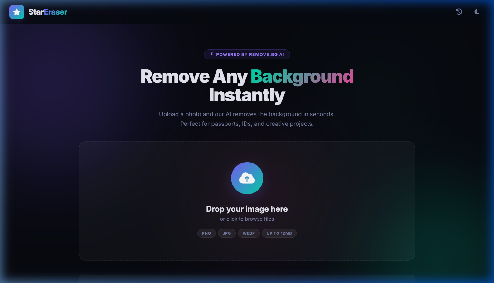
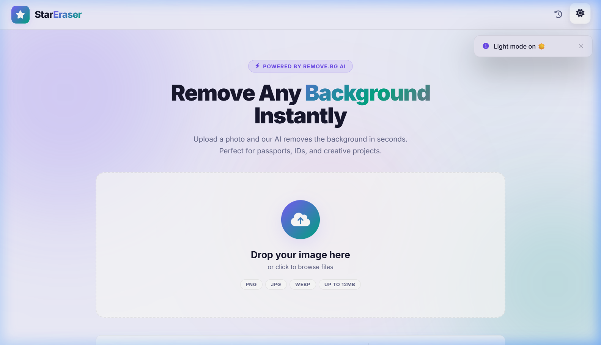
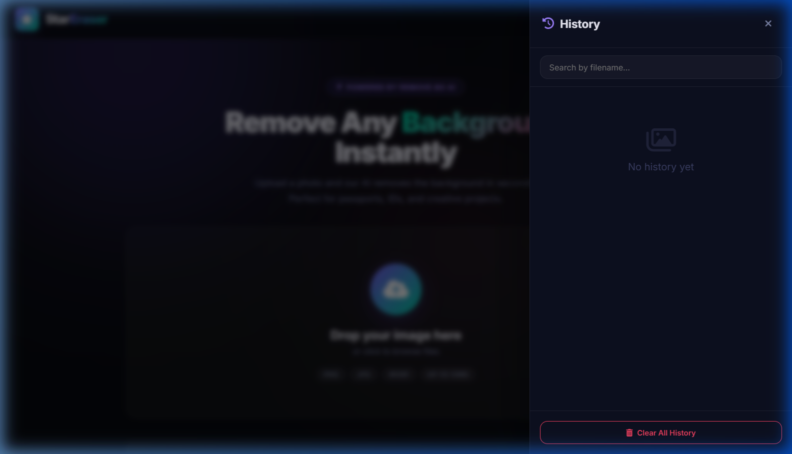

<div align="center">



# ⭐ Star Eraser

### AI-Powered Background Remover

**Remove any image background instantly.** Upload, crop, remove, download — in seconds.  
Powered by [remove.bg](https://www.remove.bg/) AI · Built with vanilla HTML, CSS & JavaScript.

[](LICENSE.txt)
[](#)
[](#)
[](https://www.remove.bg/api)

</div>

---

## 📸 Screenshots

<table>
  <tr>
    <td align="center">
      
      <b>💻 Desktop Dark</b>
    </td>
    <td align="center">
      
      <b>💻 Desktop Light</b>
    </td>
  </tr>
  <tr>
    <td align="center">
      
      <br><b>📱 Mobile Dark</b>
    </td>
    <td align="center">
      
      <br><b>📱 Mobile Light</b>
    </td>
  </tr>
  <tr>
    <td align="center" colspan="2">
      
      <br><b>📂 History Panel</b>
    </td>
  </tr>
</table>

---

## ✨ Features

| Feature | Details |
|---|---|
| 🤖 **AI Background Removal** | Powered by remove.bg API — one click, instant results |
| ✂️ **Smart Crop Tool** | Built-in Cropper.js with preset aspect ratios (passport, visa, etc.) |
| 🎨 **Background Replacement** | Solid colors · 8 gradients · Custom image upload |
| 🖨️ **A4 Print Sheet Generator** | 10 photo sizes: Passport, Stamp, PAN, US Visa, SSLC, UK/Schengen, Japan, China, Postcard, Square DP. Generates 300 DPI A4 PDF-ready sheets |
| 📤 **Multi-Format Export** | PNG · JPEG (adjustable quality) · WebP |
| 📋 **Clipboard Copy** | One click to copy the processed image |
| 📱 **Native Share** | Web Share API for mobile sharing |
| 🕐 **History Panel** | Auto-saves last 15 processed images to localStorage with search |
| ❤️ **Favorites** | Mark images as favorites, tracked in stats |
| 🌗 **Dark / Light Mode** | Smooth theme toggle, preference saved |
| ⌨️ **Keyboard Shortcuts** | `Ctrl+S` download · `T` theme · `H` history · `Esc` close · Arrow Keys for slider |
| 📊 **Usage Stats** | Processed / Favorites / Downloads counters with animated transitions |
| ✨ **Rich Micro-Interactions** | Ripple effects · Magnetic buttons · Animated counters · Processing steps indicator · Hover shimmer |
| ♿ **Accessible** | Full ARIA roles, labels, keyboard navigation |
| 📱 **Fully Responsive** | Mobile-first, works on all screen sizes |

---

## 🗂️ Project Structure

All files are in a **flat root structure** — no build tools, no bundlers, no dependencies to install.

```
Star Erase/
├── index.html          ← App entry point (semantic HTML + accessibility)
├── styles.css          ← All styles (variables, themes, animations, components)
├── script.js           ← All application logic (state, API, UI, interactions)
├── LICENSE.txt         ← MIT License
├── README.md           ← This file
└── images/             ← All screenshot assets
```

---

## 🚀 Getting Started

### Option 1 — Open directly
Just double-click `index.html` to open it in any modern browser. No server needed for basic usage.

### Option 2 — Local server (recommended for full API functionality)
```bash
# Python 3
python -m http.server 8080

# Then open: http://localhost:8080
```

### Option 3 — Node.js
```bash
npx serve .
```

---

## ⚙️ Configuration

Open `script.js` and update your API key at the top:

```js
const API_KEY = 'your_remove_bg_api_key_here';
```

Get a free API key at [remove.bg/api](https://www.remove.bg/api).  
> **Free tier:** 50 API calls/month. Each call = 1 image processed.

---

## ⌨️ Keyboard Shortcuts

| Shortcut | Action |
|---|---|
| `Ctrl` + `S` | Download current processed image |
| `T` | Toggle dark / light mode |
| `H` | Open / close history panel |
| `Esc` | Close any open panel or history |
| `←` `→` | Move before/after comparison slider |

---

## 🖨️ Supported Photo Sizes (Print Sheet)

| ID | Name | Size (mm) | Common Use |
|---|---|---|---|
| passport | Passport | 35 × 45 | Passport, Aadhaar, DL |
| stamp | Stamp | 20 × 25 | Application forms |
| visa-us | US/Canada Visa | 51 × 51 | 2×2 inch |
| pan | PAN Card | 25 × 35 | PAN card |
| sslc | SSLC/Exam | 30 × 35 | Board exam forms |
| uk-visa | UK/Schengen | 35 × 45 | UK/Europe visa |
| japan | Japan Visa | 45 × 45 | Japan visa |
| china | China Visa | 33 × 48 | China visa |
| postcard | Postcard | 102 × 152 | 4×6 inch print |
| square | Square DP | 40 × 40 | Social media |

---

## 🛠️ Tech Stack

| Layer | Technology |
|---|---|
| **Markup** | Semantic HTML5 with ARIA |
| **Styles** | Vanilla CSS3 (no Tailwind, no Bootstrap) |
| **Logic** | Vanilla JavaScript ES2020+ |
| **Crop** | [Cropper.js](https://github.com/fengyuanchen/cropperjs) v1.6.1 |
| **Icons** | [Font Awesome](https://fontawesome.com/) 6.5 |
| **Fonts** | [Inter](https://fonts.google.com/specimen/Inter) via Google Fonts |
| **AI API** | [remove.bg](https://www.remove.bg/) REST API |
| **Storage** | Browser `localStorage` (history + stats + theme) |

---

## 🎨 UI/UX Highlights

- **Animated background orbs** — slow-drifting gradient blobs
- **Glassmorphism navbar** — `backdrop-filter: blur` with scroll shadow detection
- **Ripple effects** on every interactive element
- **Animated hero gradient** — cycling gradient animation on "Background" text
- **Drop zone** — border-spin conic-gradient animation on hover
- **Floating icon** — `iconFloat` keyframe animation on the upload icon
- **Processing steps indicator** — Uploading → Analysing → Removing → Finishing
- **Animated progress bar** — shimmer-style gradient fill
- **Animated counters** — ease-out cubic interpolation
- **Before/After slider** — drag, touch, and keyboard support with `dragging` state class
- **Panel accordion** — smooth `max-height` expansion with `transform` slide-in
- **Bounce transitions** — `cubic-bezier(.34,1.56,.64,1)` spring physics on buttons
- **Heart beat animation** — scales on favorite toggle
- **History items** — hover lift with `translateY` + box-shadow
- **Toast with dismiss** — slide-in from right, close button, auto-removes after 4s

---

## 🔒 Privacy

All image processing happens via the [remove.bg API](https://www.remove.bg/privacy). No images are stored on any server controlled by this project. History is stored **only in your browser's localStorage**.

---

## 📄 License

This project is licensed under the **MIT License** — see the [LICENSE.txt](LICENSE.txt) file for full details.

```
Copyright (c) 2026 Starverse (Ayush Gupta)
```

---

<div align="center">

Made with ❤️ by **Ayush Gupta** from **Starverse** &nbsp;·&nbsp; Star ⭐ if you find it useful!

</div>
