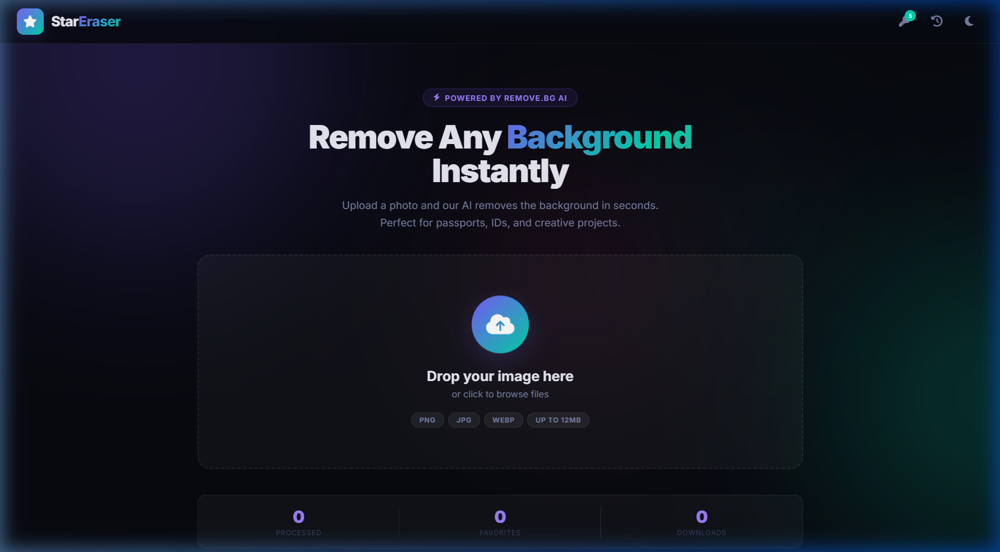
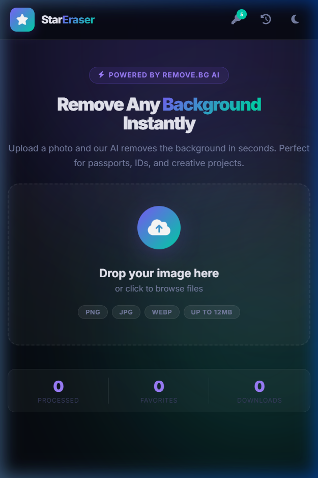
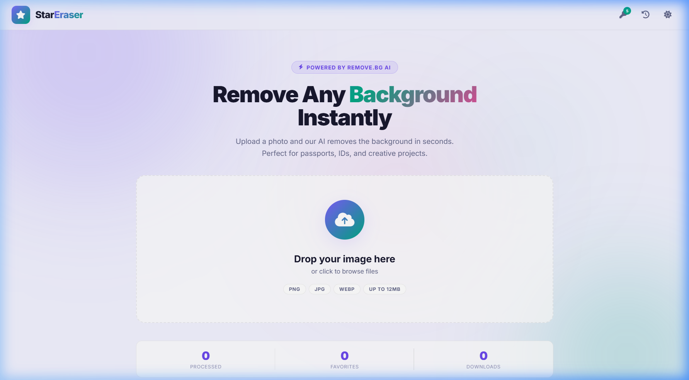
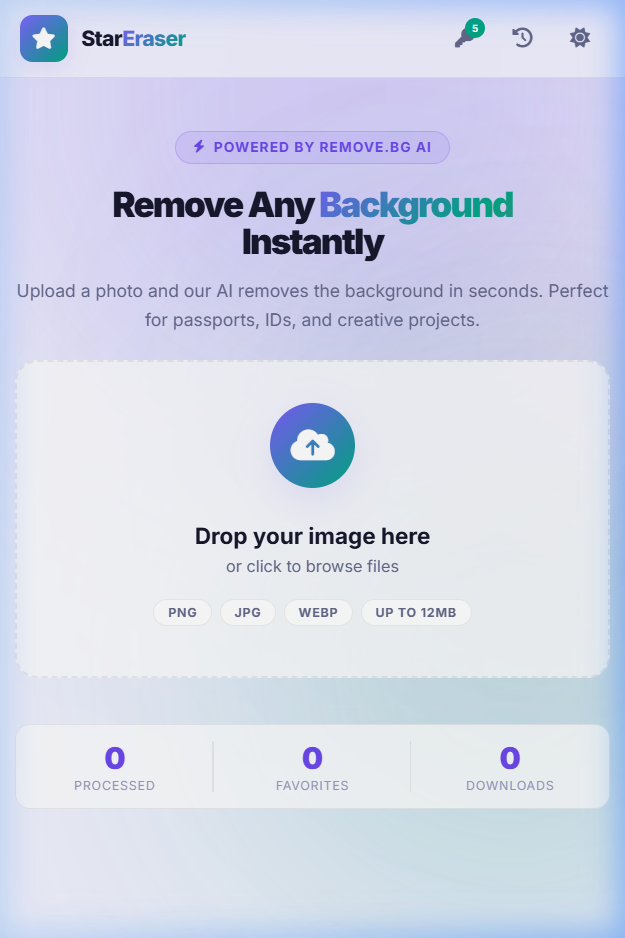

<div align="center">



# ⭐ Star Eraser
**Professional AI-Powered Background Remover**

Remove any image background instantly. Upload, crop, remove, and download in seconds. Powered by the industry-leading remove.bg AI and built to deliver a seamless, responsive experience across all devices.

[](https://starerase.netlify.app/)
[](LICENSE.txt)

</div>

---

## 📸 Screenshots

| 💻 Desktop | 📱 Mobile |
| :---: | :---: |
|  <br> **Dark Theme** |  <br> **Dark Theme** |
|  <br> **Light Theme** |  <br> **Light Theme** |

---

## ✨ Key Features

- **Instant AI Background Removal** — High-precision cutouts via remove.bg API.
- **Smart Cropping Tool** — Pre-configured aspect ratios for Passports, Visas, and IDs.
- **Background Replacement** — Apply solid colors, gradients, or custom uploaded backgrounds.
- **Print-Ready Sheets** — Automatically generate A4 print sheets (up to 300 DPI) for various photo sizes.
- **Local History & Management** — Auto-saves processed images securely in your browser's local storage.
- **Multi-Format Export** — Download as PNG, JPEG (with quality control), or WebP.

---

## 🚀 How to Use

1. **Visit the Live Site:** Go to [https://starerase.netlify.app/](https://starerase.netlify.app/)
2. **Upload an Image:** Drag & drop or click to upload your photo (PNG, JPG, WEBP supported, up to 12MB).
3. **Crop (Optional):** Use the built-in crop tool to frame your subject perfectly or skip straight to processing.
4. **Remove Background:** The AI automatically detects the subject and removes the background in seconds.
5. **Customize:** After processing, use the toolbar to add a new background color/image or create a print sheet.
6. **Download:** Export your final image using the Quick Download button in your preferred format.

*(Note: The app includes 5 free uses. Afterwards, you can easily plug in your own free remove.bg API key via the settings menu for unlimited use).*

---

## 🗂️ Project Structure

The project has a clean, dependency-free architecture using only Vanilla web technologies.

```
Star Erase/
├── index.html       # Application entry point & semantic structure
├── styles.css       # Fully responsive UI/UX styling & custom themes
├── script.js        # Core logic, API integration, and state management
├── README.md        # Project documentation
├── LICENSE.txt      # MIT License file
└── images/          # Documentation assets & screenshots
```

---

## ⚙️ Development

If you'd like to run the project locally or contribute:

```bash
# Clone the repository
git clone https://github.com/Starverse1130/StarEraser.git

# Navigate to the project directory
cd StarEraser

# Serve locally (Requires Python 3)
python -m http.server 8080

# Alternatively, using Node.js
npx serve .
```
Then open `http://localhost:8080` in your browser.

---

<div align="center">

### 👨‍💻 Developer Info

**Built with ❤️ by Ayush Gupta (Starverse)**

[](https://github.com/Starverse1130)  
[](#)  
[](#)

*If you found this project helpful, please consider giving it a ⭐ on GitHub!*

</div>
